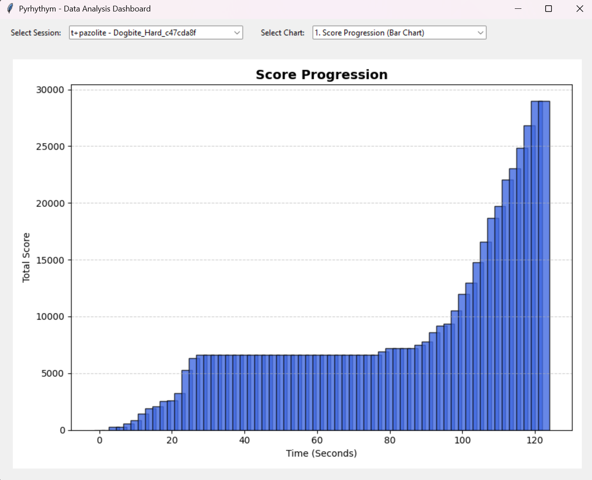
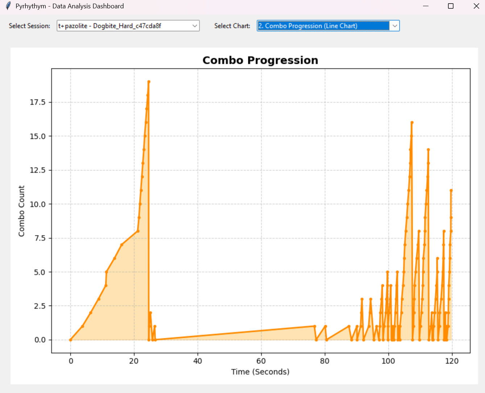
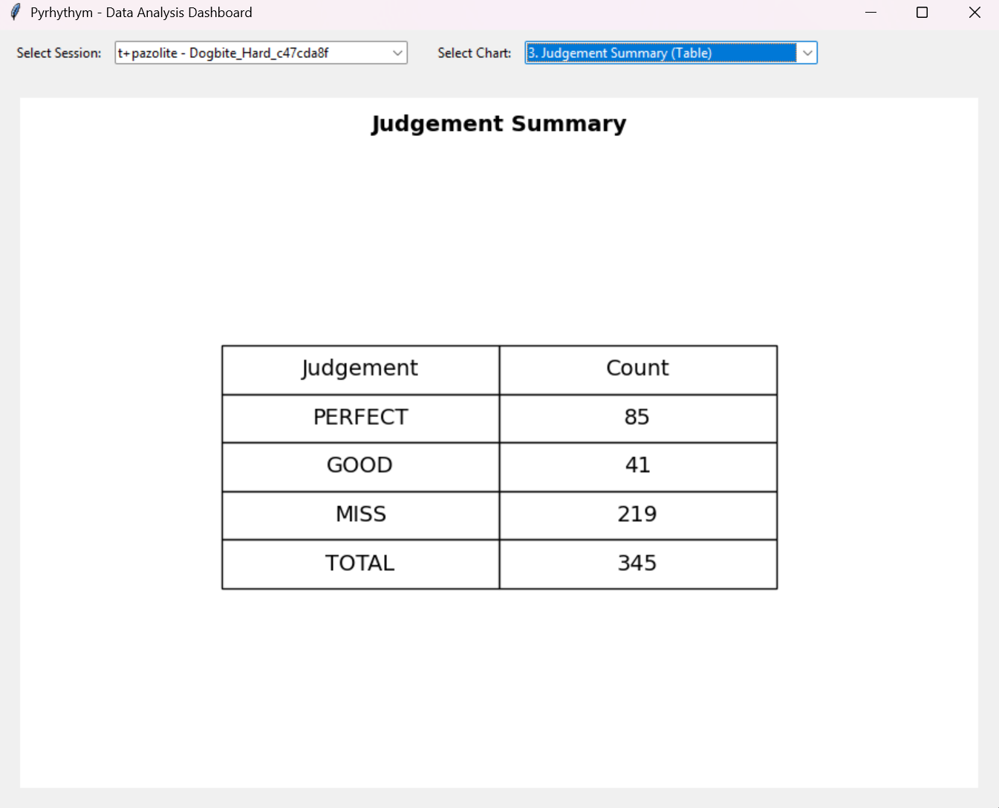
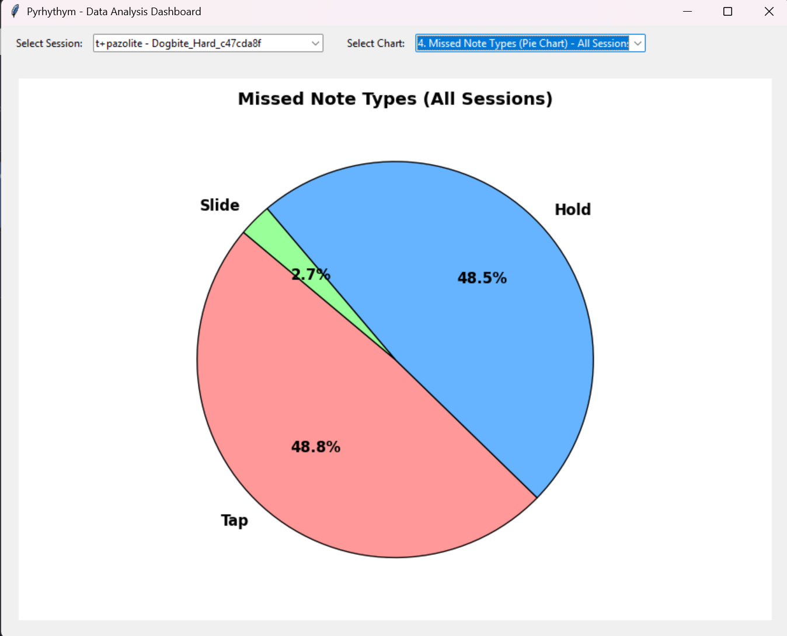
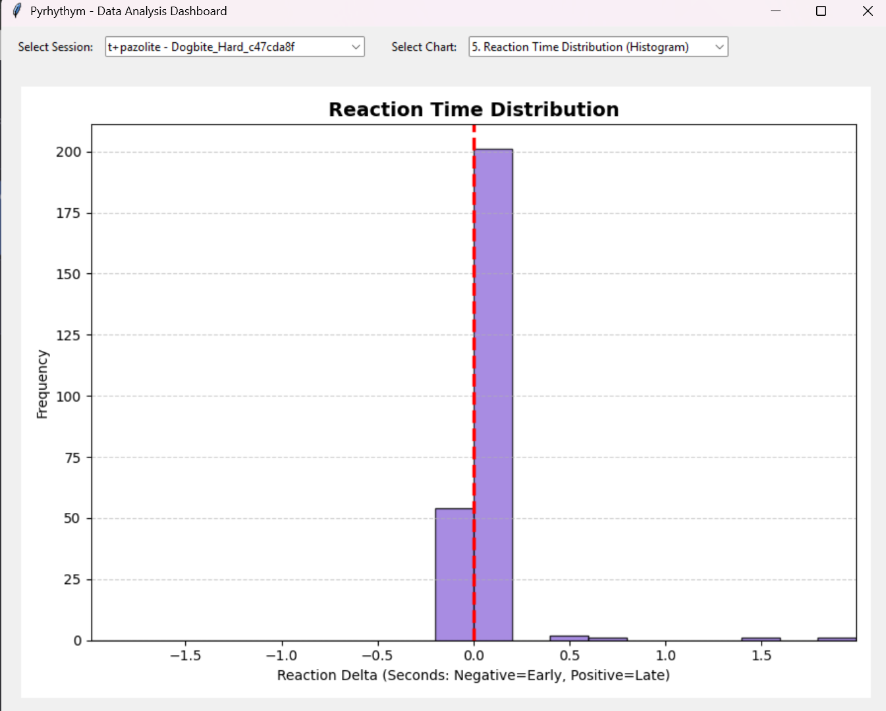

# Pyrhythym — Data Visualization

This document explains the five data visualizations available in the Analytics window (`python analytics.py`). All charts are generated from CSV logs recorded automatically during gameplay and stored in the `data_logs/` folder.

---

## Graph 1 — Player Score Over Time

This line graph shows how the player's score grows throughout a single session. The X-axis is time in seconds and the Y-axis is the normalized score (0–100,000). Each data point is sampled every 5 seconds of song time, so the steepness of the line reflects how consistently the player is hitting notes — a steep climb means a strong streak of PERFECT and GOOD hits, while a flat or slow section means the player was missing notes and earning little score during that period. This graph is useful for identifying exactly which part of a song the player struggles with.

---

## Graph 2 — Player Combo Over Time

This bar graph breaks the song into 10-second intervals and shows the highest combo the player reached inside each interval. A tall bar means the player maintained a long unbroken streak during that window, while a short or missing bar means a miss reset the combo early. Comparing the bar heights across the song reveals which sections are the hardest to chain — for example, a sudden drop in the middle of the song often points to a dense hold or slide section that catches the player off guard. Chart makers can use this graph to decide where to add or remove notes to balance difficulty.

---

## Graph 3 — Performance Summary Table

This table gives a full summary of every session loaded for the selected song and difficulty. Each row shows the song name, session ID, number of PERFECT hits, GOOD hits, MISS hits, and overall accuracy. Accuracy is calculated as `(PERFECT + GOOD × 0.5) / total notes × 100`. Having all sessions in one table makes it easy to track improvement over time — if the PERFECT count goes up and the MISS count goes down across rows, the player is genuinely getting better at this song. The table covers all sessions found in `data_logs/` that match the selected song and difficulty.

---

## Graph 4 —  Types of Notes Missed

This pie chart shows the proportion of misses broken down by note type: Tap, Hold, and Slide. Each slice represents the percentage of total misses that came from that note type. If the Slide slice is large, it means the player is not keeping the mouse on the correct side of the screen during slide windows. A large Hold slice suggests the player is releasing keys too early. A large Tap slice means the player is either hitting too early, too late, or missing keypresses entirely. This chart gives a quick summary of which skill area needs the most practice.

---

## Graph 5 — Reaction Time Distribution

This histogram shows the distribution of the player's reaction time for every note that was not a PERFECT hit. The X-axis is reaction time in milliseconds — positive values mean the player hit late, negative values mean the player hit early. A normal distribution curve is overlaid on the histogram so the player can see whether their timing is centered around zero (accurate on average) or shifted to one side (consistently early or late). The mean (μ) and standard deviation (σ) are shown in the legend. A narrow distribution close to zero is the goal; a wide spread means the player's timing is inconsistent.

---

## How the Data is Collected

| Log file | Collected when | Used in |
|---|---|---|
| `_score.csv` | Every 2 seconds during play | Graph 1 |
| `_combo.csv` | Every time combo changes | Graph 2 |
| `_hit.csv` | Every note press (including miss) | Graph 3, Graph 5 |
| `_reaction.csv` | Every non-PERFECT hit | Graph 4 |

All files are exported automatically to `data_logs/` when a song session ends. Each row includes a `session_id` so data from different playthroughs can be separated and compared.
